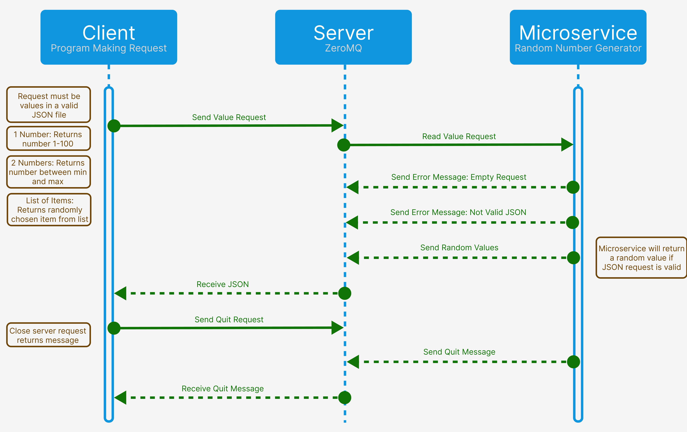

# Random Value Generator

A Python-based microservice capable of receiving requests for a random value through TCP connections set up via ZeroMQ.

### How It Works

Random_Value_Generator.py runs as a server using ZeroMQ REP socket.

   * It listens for incoming value requests via a TCP server connection.
   * It sends back a random value depending on the request format of the sender.
   * Requests musts be made in valid JSON format.

### Request formats
As stated above, all requests must be in valid JSON format.

| Request  | Return/Action                      |
|----------|------------------------------------|
| One element == "Q"  | Break communication and shut down the server |
| One element != "Q" | A random float inclusively between 1 and 100 |
| Exactly two elements in 'min, max' format    | A random float between the two numbers |
| Two or more elements not in 'min, max' format    | A random element from the sequence |

### Making a Request

1. Establish a ZeroMQ context object
2. Create a socket w/ the context & establish connection on the host and port with 'socket = context.socket(zmq.REQ)'
   * connection is currently set to target "tcp://localhost:55555"
3. Create a valid JSON object in a format listed in the table above.
4. Send the JSON object via 'socket.send_json()'

#### Example Request
```python
import zmq

context = zmq.Context()

print("Connecting to server")
socket = context.socket(zmq.REQ)
socket.connect("tcp://localhost:55555")

request = [1,1000]
socket.send_json(request)
```
### Receiving a Response

After having sent the data, assign a variable equal to 'socket.recv()'

#### Example of Receiving
```python
message = socket.recv_json()
```

## UML



## Tech Stack

Python 3.13

ZeroMQ (pyzmq) — Microservice communication

JSON — Data serialization for player saves

### Author

Joshua Hutson & Andrew Taylor